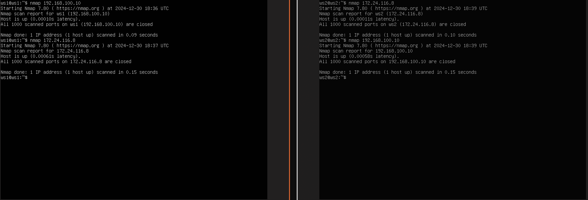
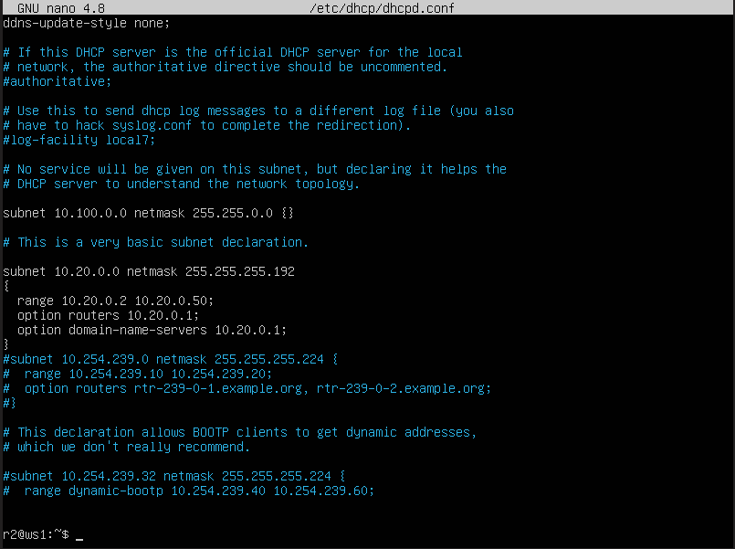
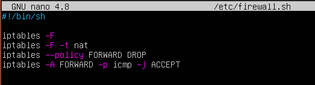

## Part 1. Инструмент **ipcalc**

Определяем и записываем в отчёт:

##### 1) Адрес сети *192.167.38.54/13[v](https://)*


2) Перевод маски *255.255.255.0* в префиксную и двоичную запись, */15* в обычную и двоичную, *11111111.11111111.11111111.11110000* в обычную и префиксную
   1. 255.255.255.0:


   
   2. 15:
   
   

   3. 11111111.11111111.11111111.11110000:
   
   

##### 3) Минимальный и максимальный хост в сети *12.167.38.4* при масках: 
1.*/8*:


2. *11111111.11111111.00000000.00000000*:


3. *255.255.254.0*:


4. */4*:


#### 1.2. localhost

##### Определяем, можно ли обратиться к приложению, работающему на localhost, со следующими IP: *194.34.23.100*, *127.0.0.2*, *127.1.0.1*, *128.0.0.1*
На localhost можно обратиться к следующим IP:
- 127.0.0.2
- 127.1.0.1
Остальные относятся к публичным IP-адресам

#### 1.3. Диапазоны и сегменты сетей

##### 1) Какие из перечисленных IP можно использовать в качестве публичного, а какие только в качестве частных: *10.0.0.45*, *134.43.0.2*, *192.168.4.2*, *172.20.250.4*, *172.0.2.1*, *192.172.0.1*, *172.68.0.2*, *172.16.255.255*, *10.10.10.10*, *192.169.168.1*
При выполнении данного задания запускалась утилита ipcalc c адресами. Строка Hosts/Net описывала к какому типу относился вписанный адрес.
Частные IP адреса:
10.0.0.45
192.168.4.2
172.20.250.4
172.16.255.255
10.10.10.10
Публичные IP адреса:
134.43.0.2
172.0.2.1
192.172.0.1
172.68.0.2
192.169.168.1
##### 2) Какие из перечисленных IP-адресов шлюза возможны у сети *10.10.0.0/18*:
*10.0.0.1*, *10.10.0.2*, *10.10.10.10*, *10.10.100.1*, *10.10.1.255*

Возможны только: 10.10.0.2, 10.10.10.10, 10.10.1.255
Так как диапазон согласно HostMin и HostMax должен быть в пределах: 10.10.63.254 - 10.10.63.255


## Part 2. Статическая маршрутизация между двумя машинами

##### Поднимаем две виртуальные машины (далее -- ws1 и ws2).


##### С помощью команды `ip a` смотрю существующие сетевые интерфейсы.


##### Описание сетевого интерфейса, соответствующего внутренней сети, на обеих машинах и задаем следующие адреса и маски: ws1 — *192.168.100.10*, маска */16*, ws2 — *172.24.116.8*, маска */12*.

- Скрин с содержанием изменённого файла *etc/netplan/00-installer-config.yaml* для каждой машины.
  

##### Также выполняем команду `netplan apply` для перезапуска сервиса сети (см выше).


#### 2.1. Добавление статического маршрута вручную

##### Добавляем статический маршрут от одной машины до другой и обратно при помощи команды вида `ip r add` и  пропингуем соединение между машинами.


#### 2.2. Добавление статического маршрута с сохранением
##### Переименовываю hostname и пользователей виртуальной машины на ws1 и ws2 соответственно.
##### Перезапускаю машину.

##### Добавляю статический маршрут от одной машины до другой с помощью файла */etc/netplan/00-installer-config.yaml*.

Cкрин с содержанием изменённого файла */etc/netplan/00-installer-config.yaml*.


##### Пропингуем соединение между машинами.


## Part 3. Утилита **iperf3**

#### 3.1. Скорость соединения

##### Переведём и запишем в отчёт: 8 Mbps в MB/s, 100 MB/s в Kbps, 1 Gbps в Mbps.
1. Перевод 8 Mbps в MB/s
Mbps (мегабит в секунду) и MB/s (мегабайт в секунду) отличаются тем, что 1 байт состоит из 8 бит.
Чтобы перевести мегабиты в мегабайты, нужно разделить на 8.

8 Mbps ÷ 8 = 1 MB/s

2. Перевод 100 MB/s в Kbps
MB/s (мегабайт в секунду) и Kbps (килобит в секунду) отличаются тем, что 1 мегабайт = 8 мегабит, а 1 мегабит = 1,000 килобит.
Чтобы перевести мегабайты в килобиты, нужно умножить на 8,000.

100 MB/s × 8,000 = 800,000 Kbps

3. Перевод 1 Gbps в Mbps
Gbps (гигабит в секунду) и Mbps (мегабит в секунду) отличаются тем, что 1 гигабит = 1,000 мегабит.
Чтобы перевести гигабиты в мегабиты, нужно умножить на 1,000.

1 Gbps×1,000=1,000 Mbps

Таким образом, мы получили следующие результаты:

8 Mbps равно 1 MB/s.
100 MB/s равно 800,000 Kbps.
1 Gbps равно 1,000 Mbps.
#### 3.2. Утилита **iperf3**

##### Измерить скорость соединения между ws1 и ws2.
Скорость соединения составляет примерно 1.89 Gbps

Скрин с вызовом и выводом использованных команд:

## Part 4. Сетевой экран
#### 4.1. Утилита **iptables**

##### Создаю файл */etc/firewall.sh*, имитирующий файрвол, на ws1 и ws2:

- В отчёт ниже помещаю скрин с содержанием файла */etc/firewall* для каждой машины.

##### Запускаю файлы на обеих машинах командами `chmod +x /etc/firewall.sh` и `/etc/firewall.sh`.


- Разница между стратегиями, применяемые в первом и втором файлах, заключется в том что:
- 1) Правила обрабатываются в разном порядке
- 2) В первом файле на машине ws1 применяется разрешительный характер, во втором запрещательный характер,Стратегия на ws1 определяет политику, определяющую какой трафик сразу разрешен и запрещает весь остальной трафик. В ws2 соответсвенно наоборот
- 3) Если мы хотим запретить большинство трафика и разрешить только исключения, то можно использовать стратегию "запрещающее правило в начале, разрешающее правило в конце".
- 4) Стратегия "разрешающее правило в начале, запрещающее правило в конце" минимизирует риск нежелательного трафика

#### 4.2. Утилита **nmap**

##### Командой **ping** найти машину, которая не «пингуется», после чего утилитой **nmap** покажи, что хост машины запущен.


*Проверка: в выводе nmap должно быть сказано: `Host is up`*.


## Part 5. Статическая маршрутизация сети

##### Поднимам пять виртуальных машин (3 рабочие станции (ws11, ws21, ws22) и 2 роутера (r1, r2)).

#### 5.1. Настройка адресов машин
- Скрины с содержанием файла *etc/netplan/00-installer-config.yaml* для каждой машины.


##### Перезапускаем сервис сети ```sudo netplan apply``` . Если ошибок нет, командой `ip -4 a` проверяем, что адрес машины задан верно. Также пропингуем ws22 с ws21. Аналогично пропингуем r1 с ws11.

- Скрины с вызовом и выводом использованных команд.


#### 5.2. Включение переадресации IP-адресов

##### Для включения переадресации IP выполняем команду на роутерах:

`sysctl -w net.ipv4.ip_forward=1`

- Cкрин с вызовом и выводом использованной команды.

##### Открой файл */etc/sysctl.conf* и добавь в него следующую строку:

`net.ipv4.ip_forward = 1`
*При использовании этого подхода, IP-переадресация включена на постоянной основе.*

- В отчёт помещаяем скрин с содержанием изменённого файла */etc/sysctl.conf*.


Достаточно раскомментировать строку ```net.ipv4.ip_forward = 1```
#### 5.3. Установка маршрута по умолчанию

Пример вывода команды `ip r` после добавления шлюза:

```
default via 10.10.0.1 dev eth0
10.10.0.0/18 dev eth0 proto kernel scope link src 10.10.0.2
```

##### Настраиваем маршрут по умолчанию (шлюз) для рабочих станций. Для этого добавляем `default` в файле конфигураций.

- Скрин с содержанием файла *etc/netplan/00-installer-config.yaml*;


##### Вызови `ip r` и покажи, что добавился маршрут в таблицу маршрутизации.

- Cкрин с вызовом и выводом использованной команды после применений настроек конфигурационного файла.


##### Пропингуй с ws11 роутер r2 и покажи на r2, что пинг доходит. Для этого используй команду:

`tcpdump -tn -i eth0`

- Cкрин с вызовом и выводом использованных команд.

#### 5.4. Добавление статических маршрутов

##### Добавляем в роутеры r1 и r2 статические маршруты в файле конфигураций. 
- Скрин с содержанием изменённого файла *etc/netplan/00-installer-config.yaml* для каждого роутера.

##### Вызываем `ip r` и показываем таблицы с маршрутами на обоих роутерах. П


##### Запускаем команды на ws11:

`ip r list 10.10.0.0/[маска сети]` и `ip r list 0.0.0.0/0`

- В отчёт помещаем скрин с вызовом и выводом использованных команд;

- В отчёте объясни, почему для адреса 10.10.0.0/\[маска сети\] был выбран маршрут, отличный от 0.0.0.0/0, хотя он попадает под маршрут по умолчанию.

Адрес  0.0.0.0/0 в роутинге - специализированный и обозначает «все возможные ip-адреса». Маршрутизаторы выбирают наиболее специфический маршрут для передачи пакетов. Это означает, что если существует маршрут, который более точно соотвествует адресу назначения, он будет предпочтительнее маршрута по умиолчанию. В данном задании адрес 10.10.0.0/18 является более точным адресом.
#### 5.5. Построение списка маршрутизаторов

Пример вывода утилиты **traceroute** после добавления шлюза:

```
1 10.10.0.1 0 ms 1 ms 0 ms
2 10.100.0.12 1 ms 0 ms 1 ms
3 10.20.0.10 12 ms 1 ms 3 ms
```

##### Запусти на r1 команду дампа:

`tcpdump -tnv -i eth0`

##### При помощи утилиты **traceroute** построим список маршрутизаторов на пути от ws11 до ws21.

- В отчёт помести скрины с вызовом и выводом использованных команд (tcpdump и traceroute);

traceroute:


tcpdump:


- В отчёте, опираясь на вывод, полученный из дампа на r1, объясни принцип работы построения пути при помощи **traceroute**.
Traceroute - это программа, которая предназначется для определения маршрутов следования данных в сетях. Позволяет видеть через какие узлы проходят пакеты, как они проходят от источника и до назначения через всю сеть. Traceroute отправляет серию пакетов с специальным значением TTL (Time to live), и возвращает ответ в виде количества "прыжков", то есть в количестве проходимых маршрутизаторов, прежде, чем эта серия пакетов будет уничтожена. Если пакет уничтожен, то программа понимает, что ей передано сообщение "Time Exceed" (время истекло), что означает, что пакет не смог достичь назначения в пределах установленного времени.
#### 5.6. Использование протокола **ICMP** при маршрутизации

##### Запускаем на r1 перехват сетевого трафика, проходящего через eth0 с помощью команды:

`tcpdump -n -i eth0 icmp`

##### Пропингуем с ws11 несуществующий IP (например, *10.30.0.111*) с помощью команды:

`ping -c 1 10.30.0.111`

- Скрин с вызовом и выводом использованных команд.


## Part 6. Динамическая настройка IP с помощью **DHCP**

##### Для r2 настраиваем в файле */etc/dhcp/dhcpd.conf* конфигурацию службы **DHCP**:
Но для начала установим саму службу ```sudo apt-get install isc-dhcp-server```

##### 1) Укажем адрес маршрутизатора по умолчанию, DNS-сервер и адрес внутренней сети. Файл для r2:

##### 2) В файле *resolv.conf* пропишем `nameserver 8.8.8.8`.
Фай расположен по адресу /etc/resolv.conf

##### Перезагружаем службу **DHCP** командой `systemctl restart isc-dhcp-server`. Машину ws21 перезагружаем при помощи `reboot` и через `ip a` покажем, что она получила адрес. Также пропингуй ws22 с ws21.
Перезагружаем службу DHCP:


Через `ip a` покажем, что она получила адрес:


И пропингуем с ws21 до ws22:

##### Укажем MAC-адрес у ws11, для этого в *etc/netplan/00-installer-config.yaml* надо добавить строки: `macaddress: 10:10:10:10:10:BA`, `dhcp4: true`.


Также в настройках VirtualBox назначаю адаптеру новый MAC-адрес
##### Для r1 настроим аналогично r2, но сделаем выдачу адресов с жесткой привязкой к MAC-адресу (ws11). Проведем аналогичные тесты.
Изначальный IP адрес ws11:


Для r1 настраиваем в файле */etc/dhcp/dhcpd.conf* конфигурацию службы **DHCP**:
назначим для машины ws11 адрес 10.10.0.30


В файле *resolv.conf* пропишем:


Чтобы настройки применились применим команду `systemctl restart isc-dhcp-server`
Перезагрузим роутер r1 командой `reboot`
И далее перезагрузим нашу виртуальную машину ws11, чтобы увидеть что IP-адрес изменился на назначенный нами:


Какими опциями **DHCP** сервера пользовался в данном пункте:

- subnet - определяет подсеть, в которой будет работать DHCP. 
- range - диапазон IP-адресов, которые сервер будет назначать клиентам.
- option routers - IP-адрес шлюза по умолчанию.
- host - настройка для статического IP-адреса для устройства с заданным MAC-адресом
- fixed-address - фиксированный адрес устройства.


## Part 7. **NAT**

##### В файле */etc/apache2/ports.conf* на ws22 и r1 изменим строку `Listen 80` на `Listen 0.0.0.0:80`, то есть сделаем сервер Apache2 общедоступным.


##### Запусти веб-сервер Apache командой `service apache2 start` на ws22 и r1.

##### Добавим в фаервол, созданный по аналогии с фаерволом из Части 4, на r2 следующие правила:

##### 1) Удаление правил в таблице filter — `iptables -F`;

##### 2) Удаление правил в таблице «NAT» — `iptables -F -t nat`;

##### 3) Отбрасывать все маршрутизируемые пакеты — `iptables --policy FORWARD DROP`.


##### Запустим файл также, как в Части 4.


##### Проверим соединение между ws22 и r1 командой `ping`.

*При запуске файла с этими правилами, ws22 не должна «пинговаться» с r1.*


##### Добавим в файл ещё одно правило:

##### 4) Разрешить маршрутизацию всех пакетов протокола **ICMP**.

##### Запусти файл также, как в Части 4.

##### Проверим соединение между ws22 и r1 командой `ping`.

*При запуске файла с этими правилами, ws22 должна «пинговаться» с r1.*


##### Добавим в файл ещё два правила:

##### 5) Включим **SNAT**, а именно маскирование всех локальных IPиз локальной сети, находящейся за r2 (по обозначениям из Части 5 — сеть 10.20.0.0).

##### 6) Включи **DNAT** на 8080 порт машины r2 и добавить к веб-серверу Apache, запущенному на ws22, доступ извне сети.


##### Запустим файл также, как в Части 4.
##### Проверим соединение по TCP для **SNAT**: для этого с ws22 подключиться к серверу Apache на r1 командой:

`telnet [адрес] [порт]`


##### Проверим соединение по TCP для **DNAT**: для этого с r1 подключиться к серверу Apache на ws22 командой `telnet` (обращаться по адресу r2 и порту 8080).


