# Simple Docker

Contents

1. [Chapter III](#chapter-iii)
   3.1. [Готовый докер](#part-1-готовый-докер)
   3.2. [Операции с контейнером](#part-2-операции-с-контейнером)
   3.3. [Мини веб-сервер](#part-3-мини-веб-сервер)
   3.4. [Свой докер](#part-4-свой-докер)
   3.5. [Dockle](#part-5-dockle)
   3.6. [Базовый Docker Compose](#part-6-базовый-docker-compose)

## Part 1. Готовый докер

**== Задание ==**

##### Официальный докер-образ с **nginx** и скачиваем его при помощи `docker pull`.

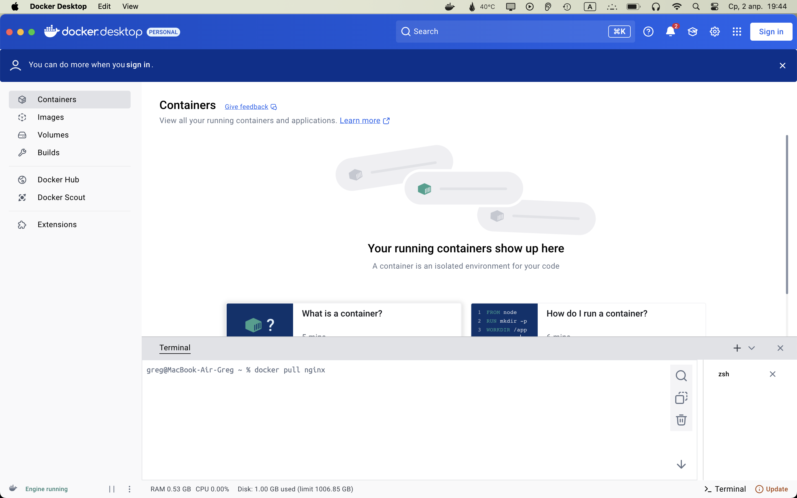

[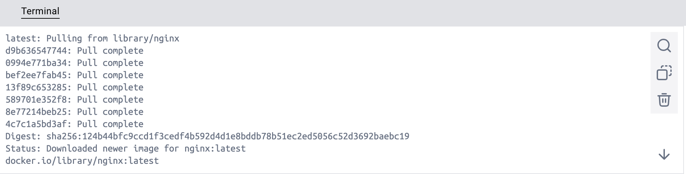](https://)

##### Проверим наличие докер-образа через `docker images`.

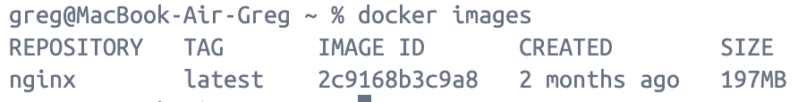

##### Запустим докер-образ через `docker run -d [image_id|repository]`.

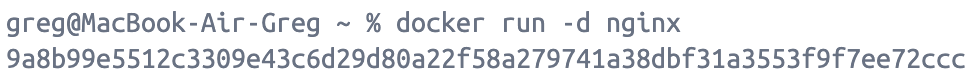

Проверим, что образ запустился через `docker ps`.

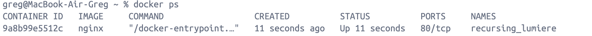

Информация о контейнере через `docker inspect [container_id|container_name]`.

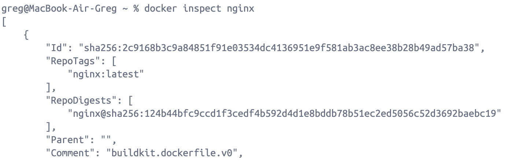

По выводу команды определим размер контейнера, список замапленных портов и ip контейнера.

**Размер контейнера** :

`docker inspect` не предоставляет прямую информацию о размере контейнера.

Для получения размера контейнера можно использовать команду:

`docker inspect --size --format='{{.SizeRootFs}}' 9a8b99e5512c`

**Cписок замапленных портов** :

`docker inspect --format='{{.NetworkSettings.Ports}}' 9a8b99e5512c`

**ip-адрес контейнера** :

`docker inspect --format='{{.NetworkSettings.IPAddress}}' 9a8b99e5512c`

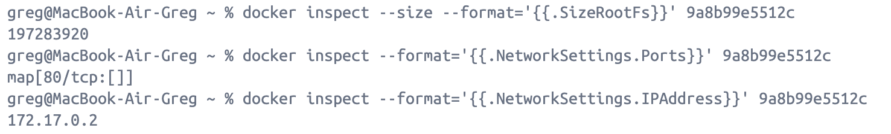

Остановим докер контейнер через `docker stop [container_id|container_name]`.

Проверим, что контейнер остановился через `docker ps`.

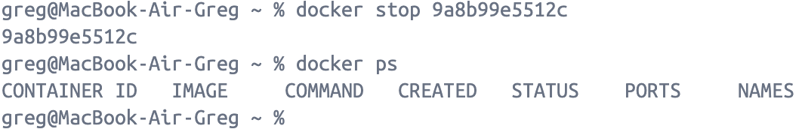

Запустим докер с портами 80 и 443 в контейнере, замапленными на такие же порты на локальной машине, через команду *run*.

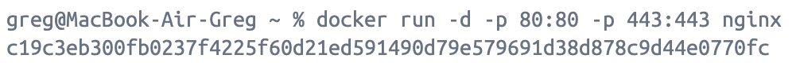

##### Проверим, что в браузере по адресу *localhost:80* доступна стартовая страница **nginx**.

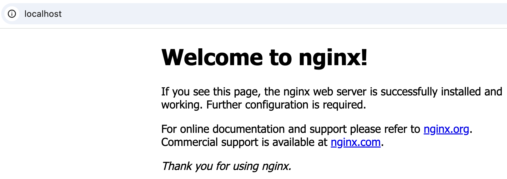

##### Перезапустим докер контейнер через `docker restart [container_id|container_name]`.

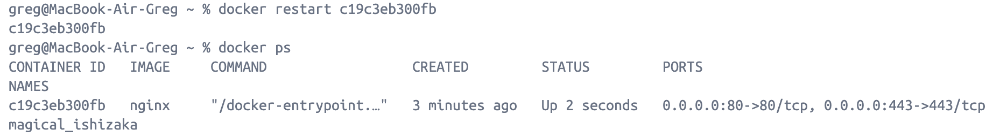

##### 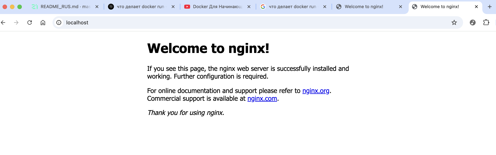Проверь, что контейнер запустился с помощью

- - вызова и вывода всех использованных в этой части задания команд;
  - стартовой страницы **nginx** по адресу *localhost:80* (адрес должен быть виден).

## Part 2. Операции с контейнером

Прочитаем конфигурационный файл *nginx.conf* внутри докер контейнера через команду *exec*.

`docker exec -it c19c3eb300fb cat /etc/nginx/nginx.conf`

вот содержимое файла nginx.conf:

##### 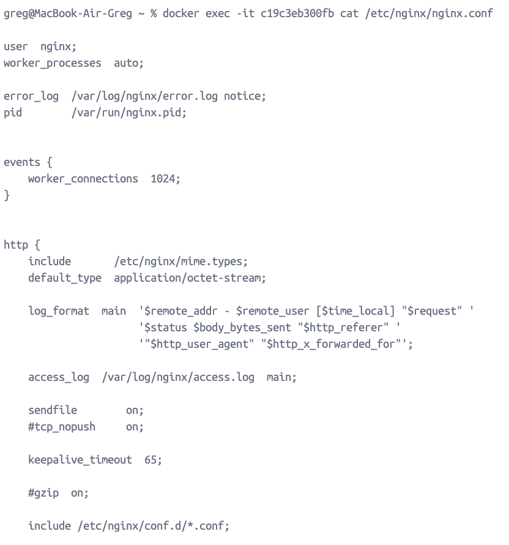

Создаем на локальной машине файл *nginx.conf*.

` docker cp /Users/greg/SCH21/DO5_SimpleDocker.ID_356282-1/src/nginx.conf c19c3eb300fb:/etc/nginx/nginx.conf`

Настроим в нем по пути */status* отдачу страницы статуса сервера **nginx**.

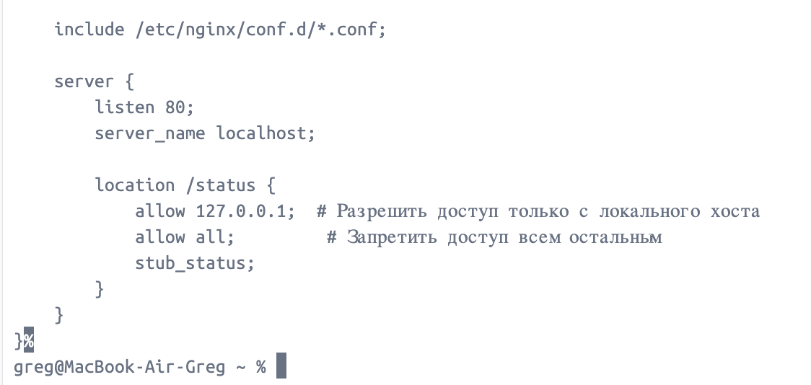

` docker exec -it c19c3eb300fb nginx -s reload`

` docker exec c19c3eb300f curl localhost/status`

##### Скопируем созданный файл *nginx.conf* внутрь докер-образа через команду `docker cp`.

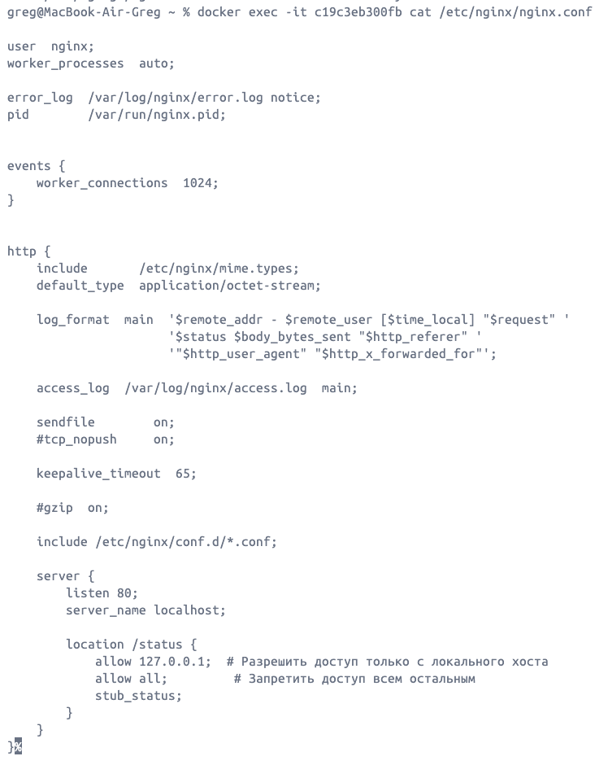

##### Перезапустим **nginx** внутри докер-образа через команду *exec*.

##### Проверим, что по адресу *localhost:80/status* отдается страничка со статусом сервера **nginx**.

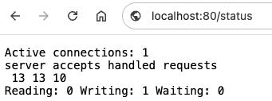

##### Экспортируем контейнер в файл *container.tar* через команду *export*.##### Остановим контейнер.

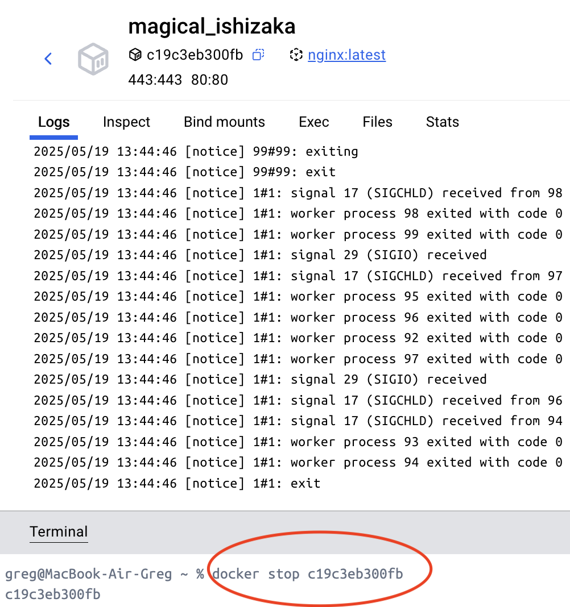

##### Удалим образ через `docker rmi [image_id|repository]`, не удаляя перед этим контейнеры.

##### 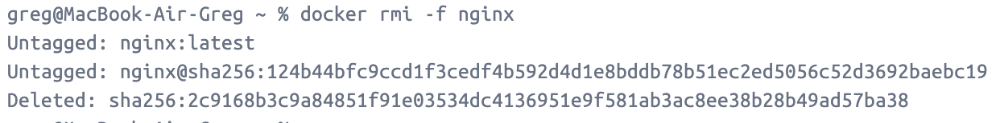Удалим остановленный контейнер.

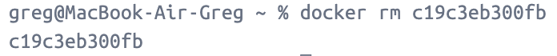

##### Импортируем контейнер обратно через команду *import*.

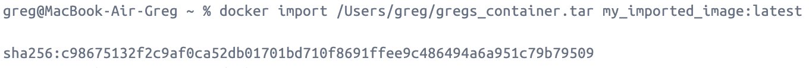

##### Запустим импортированный контейнер.

Проверим, что по адресу *localhost:80/status* отдается страничка со статусом сервера **nginx**.

На скриншоте слева список всех образов Docker, а справа вывод страницы *localhost:80/status*

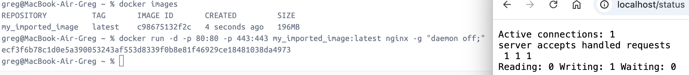

## Part 3. Мини веб-сервер

**== Задание ==**

##### Напишим мини-сервер на **C** и **FastCgi**, который будет возвращать простейшую страничку с надписью `Hello World!`.

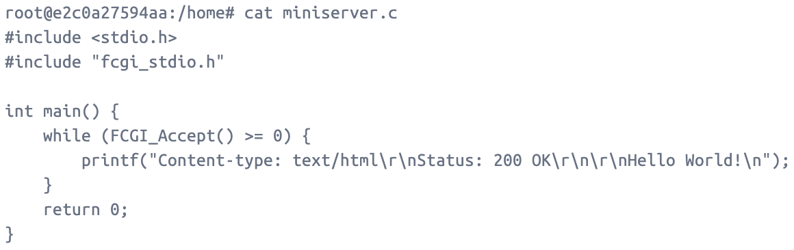

##### Запустим написанный мини-сервер через *spawn-fcgi* на порту 8080.

##### Напишим свой *nginx.conf*, который будет проксировать все запросы с 81 порта на *127.0.0.1:8080*.

1) Для запуска мини-сервера нам сначала понадобится отредактировать и скопировать nginx.conf

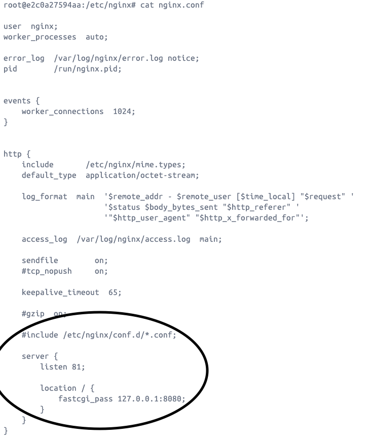

2) В контейнер скопируем файлы nginx.conf в /etc/nginx/nginx.conf и miniserver.c в /home
3) Входим в bash контейнера с помощью команды `docker exec -it e2c0a27594aa bash`
4) Доустанавливаем внутри контейнера для компиляции **spawn-fcgi и libfcgi-dev** (*spawn-fcgi используется для запуска удаленных и локальных FastCGI процессов*)
5) Компилируем наш miniserver.c и и запускаем через spawn-fcgi

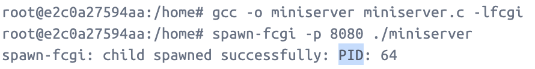

##### Проверяем, что в браузере по *localhost:81*  выводится Hello World!.

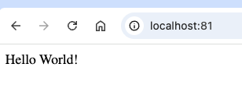

##### Положим наш файл *nginx.conf* по пути *./nginx/nginx.conf* (так как это понадобится позже).

## Part 4. Свой докер

Написание докер-образа для созданного сервера.

**== Задание ==**

Напишим свой докер-образ, который:

##### 1) собирает исходники мини сервера на FastCgi из [Части 3](#part-3-мини-веб-сервер);

##### 2) запускает его на 8080 порту;

##### 3) копирует внутрь образа написанный *./nginx/nginx.conf*;

##### 4) запускает **nginx**.

_**nginx** можно установить внутрь докера самостоятельно, а можно воспользоваться готовым образом с **nginx**'ом, как базовым._

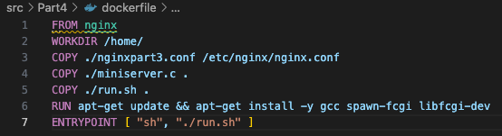

##### Соберем написанный докер-образ через `docker build` при этом указав имя и тег.

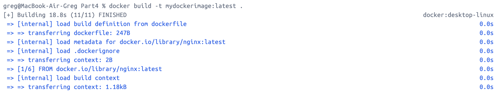

##### Проверим через `docker images`, что все собралось корректно.

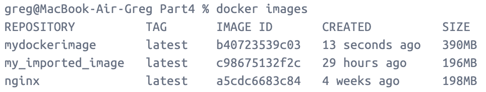

##### Запустим собранный докер-образ с маппингом 81 порта на 80 на локальной машине и маппингом папки *./nginx* внутрь контейнера по адресу, где лежат конфигурационные файлы **nginx**'а (см. [Часть 2](#part-2-операции-с-контейнером)).

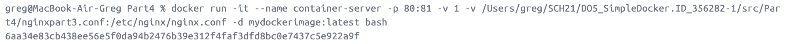

##### Проверим, что по localhost:80 доступна страничка написанного мини сервера.

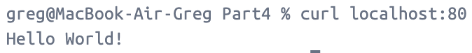

##### Допишем в *./nginx/nginx.conf* проксирование странички */status*, по которой надо отдавать статус сервера **nginx**.

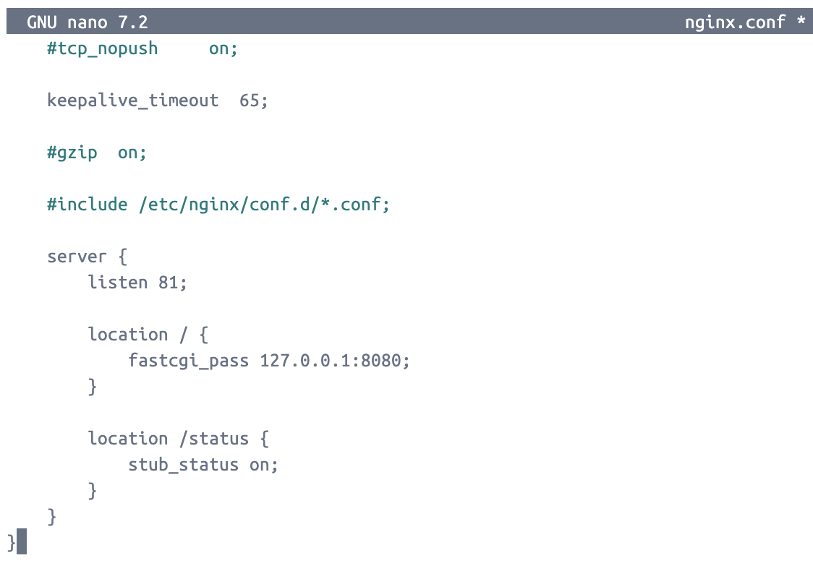!

##### Перезапустим докер-образ.

*Если всё сделано верно, то, после сохранения файла и перезапуска контейнера, конфигурационный файл внутри докер-образа должен обновиться самостоятельно без лишних действий*.

`nginx -s reload`

##### Проверим, что теперь по *localhost:80/status* отдается страничка со статусом **nginx**

## Part 5. **Dockle**

После написания образа никогда не будет лишним проверить его на безопасность.

**== Задание ==**

##### Просканируй образ из предыдущего задания через `dockle [image_id|repository]`.

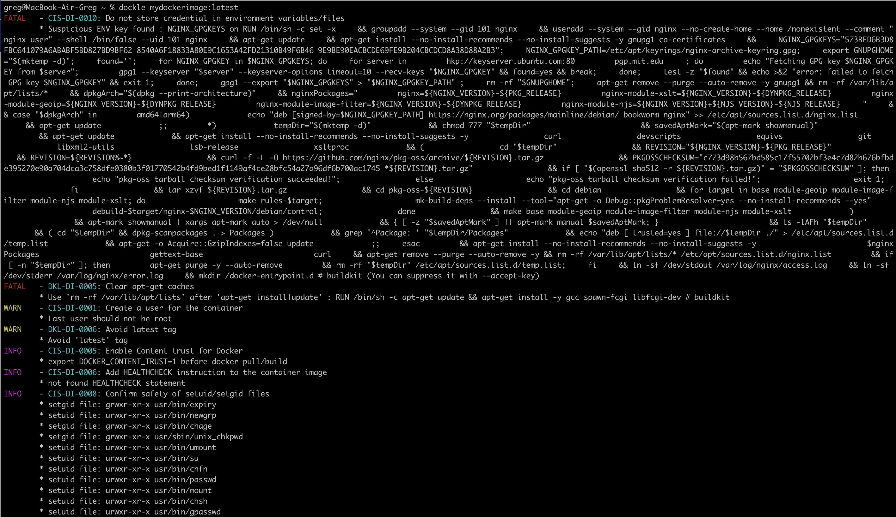

##### Исправь образ так, чтобы при проверке через **dockle** не было ошибок и предупреждений.

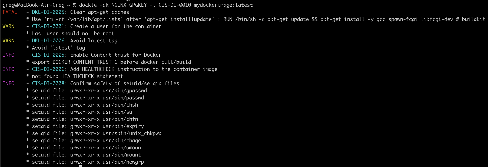

Исправленный вариант:
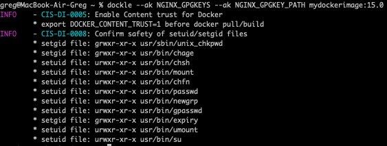

## Part 6. Базовый **Docker Compose**

**== Задание ==**

##### Напишем файл *docker-compose.yml*, с помощью которого:

##### 1) Подними докер-контейнер из [Части 5](#part-5-инструмент-dockle) _(он должен работать в локальной сети, т. е. не нужно использовать инструкцию **EXPOSE** и мапить порты на локальную машину)_.

##### 2) Подними докер-контейнер с **nginx**, который будет проксировать все запросы с 8080 порта на 81 порт первого контейнера.

##### Замапим 8080 порт второго контейнера на 80 порт локальной машины.

##### Остановим все запущенные контейнеры. Соберем и запустим проект с помощью команд `docker-compose build`

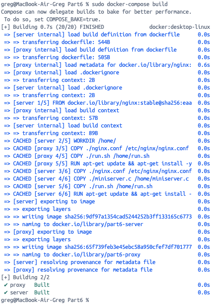

и `docker-compose up`

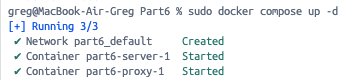

Проверим, что в браузере по localhost:80* отдается написанная тобой страничка, как и ранее.

*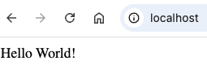

Краткая информация по всей работе по проекту DO5 SimpleDocker из Docker.Desktop на Mac
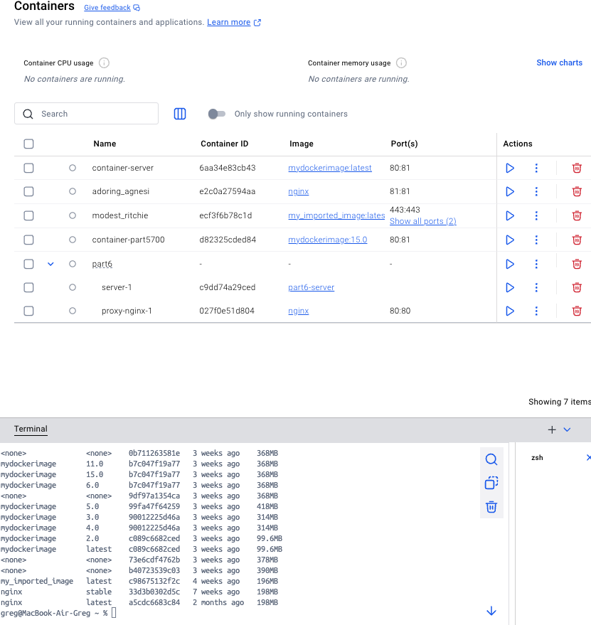
